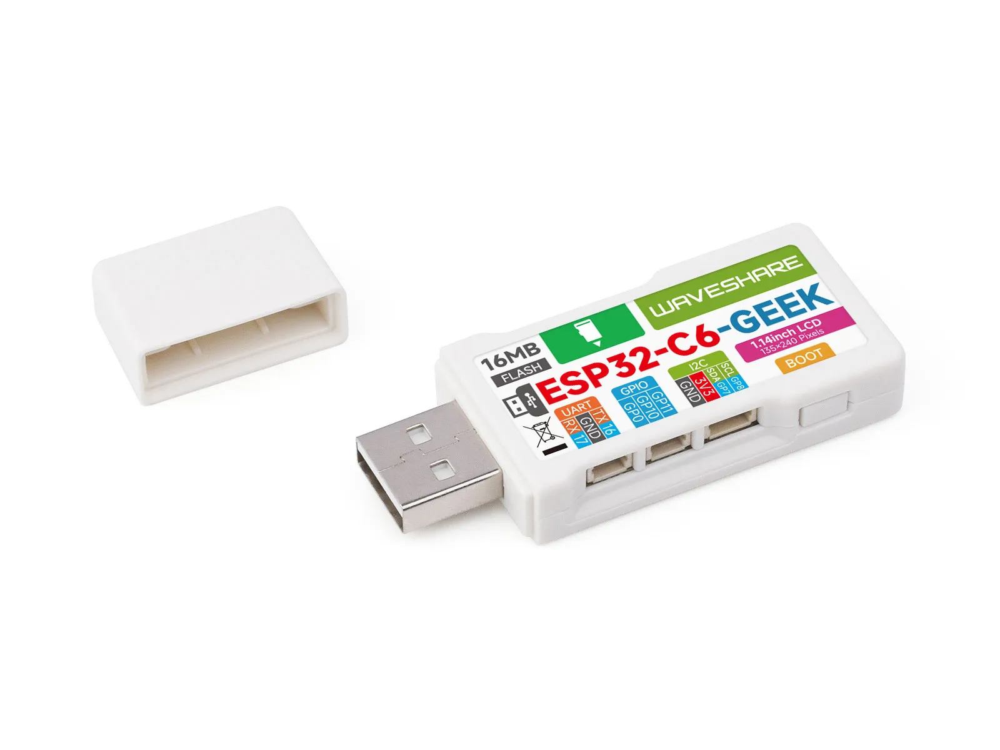

# Waveshare ESP32-C6-GEEK

[English](README.md)

ESP32-C6-GEEK 是微雪为极客设计和嵌入式开发者推出的一款小型开发板，搭载乐鑫 ESP32-C6，采用最高主频 160 MHz 的 32 位 RISC-V 处理器，集成 16 MB Flash，支持 2.4 GHz Wi-Fi 6、蓝牙 5 (LE) 和 IEEE 802.15.4。板载 1.14 英寸 240 × 135 IPS LCD、Micro SD 卡槽、USB-A 公口，并提供 UART、GPIO 和 I2C 接口，适用于无线应用、便携工具和嵌入式显示项目。

- [购买链接](https://www.waveshare.net/shop/ESP32-C6-GEEK.htm)
- [产品文档](https://docs.waveshare.net/ESP32-C6-GEEK/)



## 仓库结构

本仓库提供 ESP32-C6-GEEK 和 ESP32-C6-GEEK V2 的示例程序、预编译固件和硬件设计文件。

```text
.
├── example/         # V1 和 V2 的 Arduino 与 ESP-IDF 示例程序
├── Firmware/        # 预编译测试固件
├── hardware/        # V1 和 V2 原理图
├── LICENSE          # Apache License 2.0
├── README.md        # 英文说明
└── README_ZH.md     # 中文说明
```

## 快速开始

两个硬件版本的示例程序均位于 [`example/`](example)：

- `ESP32-C6-GEEK-Demo` 适用于 ESP32-C6-GEEK
- `ESP32-C6-GEEK_V2-Demo` 适用于 ESP32-C6-GEEK V2

示例包含 Arduino 和 ESP-IDF 工程，涵盖 LCD、Micro SD 卡、按键、Wi-Fi、Bluetooth、MQTT 和 LVGL 等应用。预编译测试固件位于 [`Firmware/`](Firmware)，原理图位于 [`hardware/schematics/`](hardware/schematics)。

开发环境搭建、固件烧录、引脚定义和示例使用方法请参阅[产品文档页面](https://docs.waveshare.net/ESP32-C6-GEEK/)。

> 请根据开发板版本选择对应的示例和固件。ESP32-C6-GEEK 与 ESP32-C6-GEEK V2 的硬件配置不同。

## 贡献

我们欢迎您的贡献！您可以通过以下方式提供帮助：

1. Fork 本仓库。
2. 为新功能或 Bug 修复创建一个新分支。
3. 提交更改并附上清晰的描述。
4. 提交 Pull Request 以供审核。

## 问题与支持

请创建 [Issue](https://github.com/waveshareteam/ESP32-C6-GEEK/issues) 并提供详细信息，或联系微雪团队并提供订单号以获取技术支持。

## 许可

本仓库遵循 Apache License 2.0 许可。详情请参阅 [LICENSE](LICENSE) 文件。

---

感谢您使用微雪电子产品！
